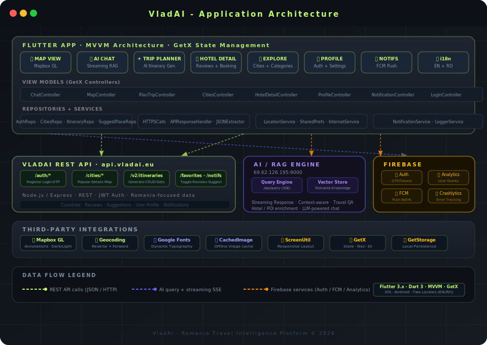

<div align="center">

<!-- Uncomment and replace with your banner screenshot -->
<!--  -->

# 🇷🇴 VladAI - Romania Travel Intelligence

**An AI-powered mobile travel companion that knows Romania like a local.**

[](https://flutter.dev)
[](https://dart.dev)
[](https://pub.dev/packages/get)
[](https://firebase.google.com)
[](https://mapbox.com)
[](/)
[](/)

> *"Plan, explore, and navigate like a local - all with the help of AI."*

</div>

---

<!-- ## 📸 Screenshots

> **📷 Action required:** Replace placeholders below with real screenshots.
> See the [Screenshot Guide](#-screenshot--recording-guide) section for what to capture.

<div align="center">

| Onboarding | AI Chat | Trip Planner | Map View |
|:----------:|:-------:|:------------:|:--------:|
|  |  |  |  |

| Hotel Detail | Explore Cities | Profile | Notifications |
|:------------:|:--------------:|:-------:|:-------------:|
|  |  |  |  |

</div>

> 🎬 **Demo Video** - [Watch on YouTube](#) *(replace with your link)* -->

---

## 🧠 What Is VladAI?

VladAI is a full-featured **AI-driven travel app** built for exploring Romania intelligently. It combines real-time interactive maps, a context-aware AI assistant, multi-step itinerary generation, and hotel discovery - all wrapped in a sleek Flutter mobile UI with bilingual support (English & Romanian).

This project was built as a **production-grade freelance delivery** showcasing the intersection of mobile engineering, AI/RAG pipelines, and UX-polished Flutter development.

---

## ✨ Feature Highlights

| Feature | Description |
|---|---|
| 🤖 **AI Travel Chat** | Streaming LLM responses via a custom RAG backend; answers context-aware travel questions about Romania |
| ✈️ **Itinerary Generator** | Multi-step wizard that generates full day-by-day itineraries based on city, dates, group size, budget, and interests |
| 🗺️ **Interactive Map** | Mapbox GL with custom annotations, category filters, dark/light toggle, and city search |
| 🏨 **Hotel & POI Discovery** | Detailed hotel pages with photo galleries, reviews, ratings, and AI-assisted inquiry |
| 🏙️ **City Explorer** | Browse popular cities, categories (accommodation / attractions / restaurants), sub-categories, and seasonal tips |
| ❤️ **Favourites** | Toggle and manage favourite places with persistent server-side storage |
| 📍 **Suggest a Place** | Community-powered place submission with location picker |
| 🔔 **Push Notifications** | Firebase Cloud Messaging (FCM) with a full in-app notification centre |
| 🌐 **Bilingual** | Full localisation in English and Romanian (ARB-based, generated l10n) |
| 🔐 **Auth Flow** | Register, Login, OTP verification, Forgot Password, Reset Password, Delete Account |
| 📊 **Analytics & Crash Reporting** | Firebase Analytics + Crashlytics with graceful non-fatal network error handling |

---

## 🏗️ Architecture

<div align="center">
  
</div>

### Pattern: MVVM + Repository + Service Layer

```
lib/
├── main.dart                        # App entry, Firebase init, Mapbox token
├── firebase_options.dart
├── l10n/                            # Localisation (EN + RO ARB files)
│   ├── app_en.arb
│   ├── app_ro.arb
│   └── generated/                   # Auto-generated Dart l10n classes
└── app/
    ├── app_widget.dart              # Root MaterialApp + GetX navigation
    ├── config/                      # App-wide constants
    │   ├── app_colors.dart          # Design token palette
    │   ├── app_text_style.dart      # Typography scale
    │   ├── app_theme.dart           # Light/dark theme config
    │   ├── app_routes.dart          # Named route definitions + bindings
    │   ├── app_urls.dart            # API endpoint constants
    │   └── app_assets.dart          # Asset path constants
    ├── customWidgets/               # Reusable UI components
    │   ├── bottom_sheets/           # Budget, Calendar, Rating, Search sheets
    │   ├── custom_dialogs/          # Alert, image, car dialogs
    │   ├── custom_pickers/          # Country code, date, location pickers
    │   └── ...                      # AppBar, buttons, tiles, map widget
    ├── mvvm/
    │   ├── model/
    │   │   ├── api_response/        # Deserialized response DTOs
    │   │   └── body_model/          # Request body models
    │   ├── view/                    # Screen widgets (one folder per screen)
    │   │   ├── bottom_bar_views/    # Chat, Map, Explore (Shop), Profile
    │   │   ├── plan_trip_views/     # 4-step itinerary wizard
    │   │   ├── hotel_detail_view/
    │   │   └── ...                  # Auth, Onboarding, Settings, etc.
    │   └── view_model/              # GetX controllers (business logic)
    ├── repository/                  # Data access layer (API abstraction)
    │   ├── auth_repo/
    │   ├── cities_repo/
    │   ├── iternity_repo/
    │   └── suggest_place_repo/
    ├── services/                    # Infrastructure services
    │   ├── https_calls.dart         # HTTP client wrapper
    │   ├── internet_service.dart    # Connectivity monitoring
    │   ├── location_service.dart    # GPS + Geocoding
    │   ├── shared_preferences_service.dart
    │   ├── logger_service.dart
    │   └── notifications_services/  # FCM + permission handling
    └── utils/
        ├── language_controller.dart
        └── localization_helper.dart
```

### Technology Decisions

| Concern | Choice | Why |
|---|---|---|
| State Management | **GetX** | Reactive observables, DI, and navigation in one package |
| Maps | **Mapbox GL Flutter** | Custom annotations, offline support, rich styling API |
| AI Backend | **Custom RAG Server** (HTTP SSE) | Streaming responses for real-time chat feel |
| Push Notifications | **Firebase FCM** | Reliable cross-platform delivery |
| Error Tracking | **Firebase Crashlytics** | Production crash insights with non-fatal network error filtering |
| Analytics | **Firebase Analytics** | Event-based insights with minimal boilerplate |
| Localisation | **Flutter ARB + gen-l10n** | Type-safe, scalable i18n |
| Image Loading | **CachedNetworkImage** | Offline-first media display |
| Responsive Layout | **flutter_screenutil** | Pixel-perfect scaling across devices |
| Local Storage | **GetStorage** | Fast, lightweight key-value persistence |

---

## 🔗 Backend Services

| Service | URL | Role |
|---|---|---|
| **VladAI REST API** | `https://api.vladai.eu/api` | Core data: auth, cities, itineraries, reviews, favourites |
| **AI / RAG Engine** | `http://69.62.126.195:9000/api/query` | Streaming LLM responses for the travel chat assistant |
| **Firebase** | Google Cloud | Auth tokens, push notifications, analytics, crash reports |

### REST API Endpoints (summary)

```
AUTH      POST /auth/register · /auth/login · /auth/verify-otp · /auth/reset-password
CITIES    GET  /cities · /cities/popular · /cities/items · /cities/map-categories
ITIN.     GET/POST /v2/itineraries · /v2/itineraries/generate
FAVS      GET  /favorites · POST /favorites/toggle
NOTIFS    GET  /notifications · POST /notifications/mark-all-read
SOCIAL    POST /user-suggestions · POST /itinerary-reviews/itinerary/:id
```

---

## 🚀 Getting Started

### Prerequisites

- Flutter **3.x** SDK
- Dart **3.x**
- Android Studio / Xcode
- A valid **Mapbox access token**
- Firebase project with `google-services.json` (Android) and `GoogleService-Info.plist` (iOS)

### Setup

```bash
# 1. Clone the repository
git clone https://github.com/hiborn4/TravelMind_App.git
cd vladai-flutter

# 2. Install dependencies
flutter pub get

# 3. Configure environment
#    - Add your Mapbox token to lib/main.dart (line: MapboxOptions.setAccessToken(...))
#    - Add google-services.json to android/app/
#    - Add GoogleService-Info.plist to ios/Runner/

# 4. Generate localisation files
flutter gen-l10n

# 5. Run on device / emulator
flutter run
```

> ⚠️ **Note:** The app connects to live backend servers. Some features (city data, AI chat, hotel details) require an active internet connection and valid API credentials.

---

## 📱 Screens Reference

| Screen | Route | Notes |
|---|---|---|
| Splash | `/splash` | Checks auth state, routes to home or onboarding |
| Get Started | `/getStartedViewOne` | Language selection onboarding |
| Login Selection | `/loginSelection` | Choose login or register |
| Login | `/loginView` | Email + password + FCM token registration |
| Sign Up | `/signUpView` | Full profile creation with country picker |
| OTP Verify | `/otpCodeView` | Email OTP validation |
| Forgot / Reset Password | `/forgotPassword` | Email OTP flow |
| Bottom Bar | `/bottomBar` | Main shell with 4 tabs |
| - Chat | (tab) | AI travel assistant with streaming responses |
| - Map | (tab) | Mapbox map with POI overlays |
| - Explore (Shop) | (tab) | Itinerary cards, city cards, favourites |
| - Profile | (tab) | User info, settings, account management |
| Plan Trip (Wizard) | `/planTrip` | 4-step itinerary generator |
| Hotel Detail | `/hotelDetail` | Full hotel page with AI chat integration |
| Tours | `/tours` | Guided tour listings |
| Category / Sub-category | `/category`, `/subcategory` | Filtered city content |
| Notifications | `/notifications` | Full notification centre |
| Account Settings | `/accountSetting` | Edit profile, language, delete account |
| Help Center / FAQ | `/helpCenter`, `/faqView` | Support content |
| Suggest a Place | `/suggestPlaceSelection` | Community place submission |

---

## 📐 Design System

| Token | Value |
|---|---|
| Primary (Lime Green) | `#C1FF71` |
| Background Dark | `#1B1C1E` |
| Secondary Dark | `#23262F` |
| Scaffold Background | `#F3F3F7` |
| Text Dark | `#1B0036` |
| Positive Green | `#21D575` |
| Error Red | `#EA4334` |
| Primary Font | Google Fonts (runtime) |

---

## 📸 Screenshot & Recording Guide

> This guide helps you capture the **best possible portfolio screenshots** for this project.

### What to Screenshot (Priority Order)

1. **AI Chat in action** - Ask "best places to visit in Cluj-Napoca in autumn" and screenshot the streaming response
2. **Trip Planner Wizard** - Capture each of the 4 steps (city select → dates → group → interests → generated itinerary)
3. **Map View** - Filter by "accommodation" category with custom pins visible
4. **Hotel Detail** - Open a hotel card showing the photo gallery, rating, and AI-chat CTA button
5. **City Explorer (Explore tab)** - Show the card-swiper with itinerary cards
6. **Onboarding / Login flow** - Language selection + Login screen

### Screenshot Best Practices

- Use a **Pixel 7 or iPhone 15 Pro** frame (or a Figma device mockup)
- Enable **Dark Mode** for the map view - the dark Mapbox style looks dramatic
- Populate the chat with **real travel queries** before screenshotting
- Use **DevicePreview** (already integrated in the app, set `enabled: true` in `main.dart`) to simulate different screen sizes

### Screen Recording Tips

- Record a **60-second walkthrough**: Open app → Chat query → Map explore → Generate trip
- Use iOS Screen Recording or `adb screenrecord` on Android
- Export at **1080p or higher**
- Add captions or a light text overlay in CapCut / DaVinci Resolve

### Placement in README

Replace the placeholder paths in the Screenshots section at the top:
```
docs/screenshots/01_onboarding.png
docs/screenshots/02_chat.png
docs/screenshots/03_planner.png
docs/screenshots/04_map.png
docs/screenshots/05_hotel_detail.png
docs/screenshots/06_explore.png
docs/screenshots/07_profile.png
docs/screenshots/08_notifications.png
```

---

## 🎯 Presentation Flow (Portfolio / Demo)

Use this order when presenting or demoing the app:

1. **Cold open** - Launch app from scratch, show splash and language selection
2. **The hook** - Open AI Chat, type *"Plan a 3-day trip to Sibiu for a couple in October"*, watch streaming response
3. **Trip wizard** - Tap "Create a new Itinerary", walk through all 4 steps, show the generated plan
4. **Map exploration** - Switch to Map tab, filter by category, tap a POI, show the detail card
5. **Hotel deep-dive** - Open a hotel detail page, scroll through photos, show reviews and AI chat CTA
6. **Profile / Settings** - Show language toggle (EN ↔ RO), notification centre, account settings

---

## 🌍 Deployment (Free Options)

| Component | Free Tier Option | Notes |
|---|---|---|
| Flutter Web preview | **Vercel** or **Netlify** | Run `flutter build web` and deploy the `build/web` folder. Useful for quick demoes |
| Backend API | Already deployed at `api.vladai.eu` | - |
| AI Engine | Already deployed | - |
| App Store | **Google Play Internal Testing** | Free internal track; perfect for portfolio reviewer access |
| App Store | **TestFlight** (iOS) | Free up to 10,000 testers |

> 💡 The most impactful portfolio move: upload an APK or TestFlight link directly in your README so reviewers can install and try it immediately.

---

## 🛣️ Roadmap

- [ ] Offline itinerary caching
- [ ] Voice input for AI chat
- [ ] AR point-of-interest overlay
- [ ] Social sharing of generated itineraries
- [ ] Weather integration per city
- [ ] Dark mode for full app (partial implementation exists)

---

## 👨‍💻 Author

**Vlad** - Flutter Developer & AI Integration Engineer

[](https://linkedin.com/in/aryan-shirke)
[](https://github.com/hiborn4)
[](https://aryanshirke.me)

> *Available for Flutter, mobile AI, and full-stack freelance projects.*

---

## 📄 License

This project was developed as a client deliverable. All rights reserved. Not for redistribution without permission.

---

<div align="center">
  <sub>Built with 💚 in Flutter · Powered by AI · Designed for Romania</sub>
</div>
